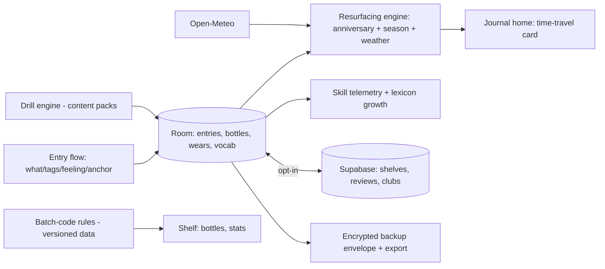

# Sillage — a diary for your most neglected sense

You have ten thousand photos and not one smell. Yet smell is the sense wired straight into memory's basement — one molecule of a stranger's perfume on a train and you are suddenly, involuntarily, in your grandmother's hallway in 1998. We built entire industries for documenting what we see and hear, and nothing — literally nothing mainstream — for the sense that time-travels. Sillage is a diary for smells: the perfume you wore the week you fell in love, the rain-on-hot-asphalt of your childhood street, the exact bakery-butter warmth of a Tuesday in Lisbon. And it is a training program for your nose — because smelling, like tasting wine, is a learnable skill, and the payoff for learning it is that the world gets deeper. Weird? Completely. Uncontested? Utterly. That's the point.

## 1. Overview
- **Elevator pitch:** A scent life-app in three movements: a **scent memory journal** (entries linking smell, place, person, emotion — resurfaced like Sentence resurfaces sentences), a **nose-training curriculum** (structured blind-smelling drills with household items, note-identification games, vocabulary building from "nice" to "indolic jasmine over cedar"), and a **perfume collection manager** for the enormous fragrance-community niche (wear tracking, seasonality, longevity ratings, structured reviews without affiliate spam).
- **Category:** Lifestyle — weird/wonderful; secondarily the fragrance-enthusiast vertical.
- **Tagline:** *A diary for your most neglected sense.*
- **Play Store positioning:** "Journal your smells. Train your nose. Know your perfumes. The first real app for the fifth sense."

## 2. Problem & Why Now
Three real audiences, zero real products. **The fragrance community is huge and badly served:** r/fragrance (2M+ members), FragranceTok ("perfumetok" videos in the billions of views), and a $60B+ global fragrance market growing double digits post-pandemic (Gen Z adopted fragrance as identity the way previous cohorts adopted sneakers) — while their software is Fragrantica (a 2000s-era website riddled with ads and affiliate links), Basenotes (a forum), and spreadsheets. Collectors literally track hundred-bottle collections in Google Sheets. **The memory-keeping audience** (Sentence's audience, Heirloom's audience) has no scent lane at all despite scent being memory's strongest trigger — the Proust effect is pop-culture common knowledge with no product attached. **The skill-learning audience** pays for wine courses, coffee-cupping kits, and ear training apps; smell training even had a mainstream moment (post-COVID anosmia recovery protocols made "smell training" a medically familiar phrase and put essential-oil kits in a million homes). Why now: all three streams converged, the category is embarrassingly empty, and — strategically — a weird app with a devoted niche is precisely the kind of product that builds a durable indie business without a marketing budget (the entire portfolio's thesis, at its purest).

## 3. Target Audience & Personas
- **Noa, 26, marketing coordinator and fragrance collector, Tel Aviv.** Forty bottles, spreadsheet refugee, films unboxings for 8k followers. Sillage replaces her sheet in one evening (wear log, seasonality, "reach-for rate" stats her spreadsheet never computed) and the structured review format makes her takes quotable. She is the vertical's anchor user.
- **Ken, 41, chef, Osaka.** Trains his palate professionally; realized his *nose* is the underdeveloped half. Runs the drills (blind-smelling his own spice shelf on the app's protocol) like knife practice. The vocabulary builder — from "smells warm" to "cinnamal, clove, a camphor edge" — measurably changes his menus. He's the skill-audience proof.
- **Amara, 34, writer, Bristol.** Not a perfume person. Journals *smell memories*: her father's pipe, the school gym, petrichor on the allotment. The app's resurfacing ("one year ago you smelled…") does to her exactly what Sentence's does — except the entries make her cry more often, because smell entries do. She's the memory audience, and the reason the journal is the app's heart rather than the collection.

## 4. Core Concept Deep-Dive
**The scent journal treats a smell like a moment, not a product.** An entry takes 40 seconds: *what* (free text + structured note tags from the taxonomy), *where/when* (auto), *who* (optional person link — the Kith instinct), *feeling* (a compact emotion wheel), and — the design's quiet masterstroke — *the anchor*: since phones can't record smell, Sillage prompts one sentence of comparison ("like wet cardboard and oranges, but warmer") because articulating a smell is precisely what encodes it into retrievable memory. The app teaches this without lecturing: placeholder prompts rotate through comparison scaffolds. Entries resurface on anniversaries and — beautifully — by *season*: the first cold morning of autumn surfaces last year's first-cold-morning entries, because smell memory is seasonal in a way date-based memory isn't (petrichor entries return with the rain via a light weather hook — the Wildergarden trick, aimed at the nose).

**Nose training is a real curriculum, gamified honestly.** Three tracks: **Foundations** (weeks 1–4: the smell-training protocol structure familiar from anosmia rehab, secularized for skill-building — daily 5-minute sessions with 4 household anchors: coffee, lemon, clove, mint; attention drills, intensity ranking, memory games like "smell A, wait 60 seconds, pick A from three"), **The Pantry Conservatory** (weeks 5–16: your kitchen as training ground — 60+ common materials organized into families; blind-drill mode where a partner or self-shuffled jars test identification; progress tracked per family), and **The Perfumer's Ladder** (advanced: note identification within compositions — "find the iris in this" exercises designed around widely available reference perfumes, plus optional integration with affordable aroma kits the app lists neutrally, no affiliate skim). Skill telemetry is genuine: identification accuracy, vocabulary depth (unique descriptors used, tracked over time), detection-memory span. The dashboard shows your nose *getting better* — the Greenroom A/B instinct applied to nostrils.

**The vocabulary builder is the connective tissue.** A living, beautiful lexicon: every note/descriptor you use or learn gets a card (what it is, where it occurs, its family, famous appearances — "indolic: the animal shadow inside white flowers; overripe jasmine; why tuberose divides rooms"). Your personal lexicon grows visibly — from 8 words to 200 — and the journal, drills, and reviews all draw from and feed it. Vocabulary *is* perception (the deep truth of all connoisseurship), and the app is built on that truth.

**The collection manager serves the obsessives without becoming a store.** Bottles: photo, size, batch code (decoded to production date via known-brand patterns — a beloved community dark art, automated), acquisition story, price paid (private). Wear log: one tap ("wearing Terre d'Hermès today"), building the stats collectors crave — reach-for rate, seasonal patterns, cost-per-wear, neglected-shelf alerts ("Vetiver Extraordinaire: unworn 14 months. Rehome?"). **Structured reviews:** no star ratings; instead the community's actual vocabulary — longevity (hours, from wear-log data when available, not vibes), sillage (intimate/arm's length/room/announcement), season/occasion mapping, and a 3-line format (opening / heart / drydown) that produces comparable, quotable takes. **No affiliate links, no store, no sponsored placement — ever.** Fragrantica's ad-choked pages are the anti-model; the community's trust is the entire asset (the Doorway wall, the Keyfob restraint — the portfolio's spine, again).

**Community, small and civilized (v1.x):** profile shelves (your collection, shareable), review following, and **Smell-Along clubs** — monthly themed communal wearings ("vetiver November": everyone wears their vetivers, logs impressions, compares) — the book-club format that FragranceTok already improvises, given plumbing. No feed algorithmics; chronology and clubs only (the Kith/no-feed discipline).

## 5. Complete Feature Set
**MVP (v1.0):**
- Scent journal: 40-second entries, note tags, emotion wheel, person/place links, comparison-anchor prompts, photo attach; anniversary + seasonal + weather-triggered resurfacing; search by note/feeling/place.
- Nose training: Foundations + Pantry Conservatory tracks, drill modes (solo-shuffle and partner), skill telemetry dashboard, session reminders (gentle, Kith-toned).
- Lexicon: 300 launch cards (notes, materials, descriptors), personal-vocabulary tracking, journal/drill integration.
- Collection: bottles with batch-code decoding (top 40 brands' patterns), wear log with one-tap today-widget, stats (reach-for, seasonality, cost-per-wear), decant/sample tracking (the community's actual unit of exchange).
- Local-first storage, encrypted backup envelope (the portfolio standard), full export.
**v1.x fast-follows:**
- Structured reviews + profile shelves + following; Smell-Along clubs; wishlist with price-drop-free neutrality (just a list — the no-store wall holds).
- Perfumer's Ladder track; aroma-kit integrations (neutral listings of Le Labo-adjacent training kits and cheap essential-oil sets alike).
- Scent map: your entries on a map (the Lisbon bakery, pinned forever); travel mode ("smells of this trip" auto-collections).
**v2.0+:**
- The Annual Nose (the Sentence hardback instinct): a printed year-book of your smell memories and collection year — the strangest, loveliest annual object in this whole portfolio.
- Household scent inventory (candles, teas, spices as trainable/journalable objects — the TAM quietly triples).
- Anosmia-recovery mode built with clinical advisors (the medically framed cousin of Foundations, done with Sway-level claims discipline — signposting, never treatment claims).

## 6. Screen-by-Screen UX Walkthrough
Navigation: bottom bar — **Journal**, **Train**, **Shelf** (collection), **Lexicon**, with **Clubs** joining in v1.x.
- **Journal (home):** today's resurfaced memory up top when one exists (the app opens on time-travel, like Sentence), then the entry stream as scent-cards (note-tag chips, feeling hue, place); the omnipresent **nose button** (FAB) starts a new entry.
- **Entry flow:** one screen, five zones (what/tags/who-where/feeling/anchor); the anchor field's rotating scaffold placeholder ("it's like ___ but ___"); save with a soft exhale animation.
- **Train:** current track + today's session card ("Day 12: intensity ladders — you'll need the coffee and the clove"); drill screens are calm, timer-paced, big-typed (eyes-closed usability: instructions are spoken, optionally); the skill dashboard (accuracy curves, vocabulary growth, memory span) framed as a naturalist's chart, not a game HUD.
- **Shelf:** bottles as a beautiful photographed grid (capture guide makes everyone's shelf look like an editorial spread — the Doorway framing-guide trick, aimed at vanity); bottle page: stats, wear history, batch info, notes pyramid, your review; decants tracked with "shared with" links (the community's generosity, recorded).
- **Lexicon:** the cards as a browsable atlas by family (citrus grove, the white-flower conservatory, the animalic cellar…); your-vocabulary view with growth over time; each card links every journal entry and bottle where it appears — *your* personal concordance of a smell.
- **Clubs (v1.x):** this month's theme, the communal log stream (chronological), your entry.
**Key flow — the involuntary memory:** Amara passes a tar-and-rope smell at a harbor → 40-second entry with anchor ("creosote — like the fence at Nan's, sun-hot") → eight months later, a warm day surfaces it → she phones her sister. The app's deepest loop is unmeasurable and the design accepts that; what it measures is that she opened the app the next day.
**Key flow — the collector's evening:** Noa unboxes a vintage bottle → Shelf → photo with guide → batch code scanned → "produced March 2009 — this is the original formulation" (the moment the app becomes indispensable to her) → wear-logs it tomorrow → reviews it in the 3-line format → her shelf link goes in her bio.
**Key flow — the drill:** Ken, 6:50am, kitchen → Train → today's blind-ladder (partner mode: his daughter shuffles three jars) → 4 minutes, two misses → accuracy curve ticks → the lexicon offers "camphoraceous" for the rosemary miss → he uses it in the journal that night. Cross-surface loops like this are the product working.

## 7. Design Language
Perfumery's visual world without its luxury clichés: apothecary warmth — cream, amber glass tones, deep bottle-green; entries carry a subtle hue from their emotion-wheel choice (the journal stream reads as a mood spectrum at a glance). Type: an elegant serif with real italics for anchors and lexicon poetry (the "indolic" card deserves typography — the Sentence bar), quiet sans for data. The lexicon cards are the design showcase: commissioned botanical-adjacent illustrations per family (a budget line, worth it — these get screenshotted). Motion: slow diffusion — things *waft* (fades and soft drifts, nothing snaps); the save-exhale. Sound: none. Haptics: a single soft pulse when a resurfaced memory lands. The app should feel like a beautiful shop you're allowed to touch everything in — with, pointedly, nothing for sale.

## 8. Technical Architecture
Opinionated stack: **Kotlin + Jetpack Compose**, local-first **Room** with the portfolio-standard encrypted backup envelope (smell memories are intimate; the Kith/Sentence posture applies unchanged); no account for solo use. Batch-code decoding: an on-device rules library (community-documented brand patterns, versioned as data, community-correctable via a suggestion flow — this is the app's most maintenance-shaped asset and it's deliberately data-not-code). Weather/season resurfacing: the Open-Meteo daily call (coarse/manual location, the Wildergarden pattern). Notes taxonomy + lexicon: a curated ontology (~300 launch nodes, versioned content packs, editorial governance like Detour's prompt deck — the ontology is the IP, same as Doorway's fact keys). Community (v1.x): **Supabase** for shelves/reviews/clubs — reviews are structured data (the Ferment lesson: structure shrinks moderation), report/block from day one. Photo pipeline with capture guides on-device. Drills: content-pack-driven session engine (tracks are data, enabling the clinical-advisor anosmia pack later without new code).

## 9. Data Model
- **Entry:** `id`, `text`, `anchor_line`, `note_tags[]`, `feeling{wheel_pos, hue}`, `person_refs[]`, `place{name, geo?}`, `photo_ref?`, `at`, `season_key`, `weather_key?`.
- **Bottle:** `id`, `perfume_ref`, `size_ml`, `remaining_est`, `batch_code?`, `produced_at?`, `acquired{date, story?, price_private?}`, `status{full|decant|sample|empty|rehomed}`, `photo_ref`.
- **Perfume (content+community):** `id`, `name`, `house`, `year?`, `notes_pyramid{top[], heart[], base[]}`, `concentration`.
- **Wear:** `bottle_id`, `date`, `context_tags[]`, `sprays?` — feeds longevity/reach-for stats.
- **Review (v1.x):** `perfume_id`, `author_id`, `three_lines{opening, heart, drydown}`, `longevity_h`, `sillage{4-scale}`, `seasons[]`, `from_wear_data:bool`.
- **LexiconNode (content):** `id`, `term`, `family`, `card_text`, `illustration_ref`, `related[]`.
- **UserVocab:** `node_id`, `first_used`, `use_count` — the growth curve's source.
- **DrillSession:** `track`, `day`, `type`, `accuracy`, `materials[]`, `duration_s`.

## 10. Monetization
One-time purchase + the physical annual, tuned to niche-devotion economics. **Free forever:** journal (unlimited — memories are never metered; the Sentence law), Foundations track, 10 bottles, lexicon browsing, resurfacing. **Sillage Complete — one-time $12.99** (₹549): unlimited collection, full training tracks, skill telemetry history, batch decoding, stats suite, scent map, clubs, widgets, backup automation. **The Annual Nose (v2) — $49:** the printed year. No subscription (the Kith/Sentence logic: this is a keepsake product; renting your memories is grotesque), no ads, no affiliate revenue — the last of these stated loudly *because* the fragrance web is an affiliate swamp and the contrast is the brand (reviews you can trust because nobody's paid is Fragrantica's exact inverse). Conversion logic: bottle #11 converts the collectors (arriving mid-devotion, the Kith person-16 pattern), the Conservatory track converts the trainers at week 5 (skill visibly climbing — the dashboard sells it), and Complete's price is set where a niche's love sits comfortably (this audience drops $200 on 50ml without blinking; $12.99 for the tool of the hobby is a rounding error, and underpricing devotion would be the actual mistake). Target: 12–15% conversion of 30-day actives — high, and plausible only because the niche is this devoted; the journal-only cohort rides free forever as designed.

## 11. Play Store Listing
- **Title (≤30):** `Sillage: Scent Diary & Nose` (27)
- **Short description (≤80):** `Journal smells, train your nose, track your perfumes. The fifth sense's app.` (76)
- **Full description:** open with the ten-thousand-photos-no-smells line; blocks: The Diary That Time-Travels (journal, resurfacing, the anchor technique), Train Your Nose Like a Palate (tracks, drills, the skill dashboard), Your Shelf, Finally Organized (collection, batch codes, wear stats), Words for What You Smell (lexicon), No Ads, No Affiliates, No Store (the trust wall, stated as a feature because it is one). Close with the petrichor line.
- **ASO keywords:** perfume collection app, fragrance tracker, scent journal, smell training, perfume wardrobe, fragrantica alternative, nose training, perfume wear log, batch code checker, scent memories.
- **Content rating:** Everyone. Community v1.x → UGC declarations, report/block.
- **Policy notes:** anosmia-adjacent content keeps Sway-grade claims discipline (training framed as skill/hobby; the recovery mode ships only with clinical advisors and signposting, never treatment claims); Data safety: local-first, opt-in sync for community features only; no ads SDKs; batch-code data is community-sourced pattern knowledge (no brand trademark claims — decode, don't authenticate; wording reviewed).

## 12. Growth & Marketing Plan
A devoted niche with dense watering holes and zero incumbent loyalty — the dream distribution map. (1) FragranceTok/PerfumeTok seeding: 30 creators get early access; the shelf-grid screenshot and the batch-decode moment are the two native demo beats (both already exist as manual content formats — the app just makes them effortless); the "no affiliates ever" stance is itself creator-quotable in a scene wearied by shilling. (2) r/fragrance and Basenotes: the honest-dev-post playbook (Sway/Ferment discipline), plus a genuinely useful free artifact — the batch-code pattern library published as an open reference page (link-magnet, goodwill, and recruitment for pattern corrections in one). (3) The Smell-Along as marketing: monthly themes announced publicly ("vetiver November") work as hashtag events whether or not participants have the app yet — the club format recruits its own members. (4) The memory audience arrives through crossover content: "the Proust effect, and how to keep yours" essays pitched to the newsletters that covered Sentence-shaped products; Amara's use case is the press angle (the weird app that made someone cry about creosote). (5) Gift season: Complete gift codes + (v2) the Annual Nose as the strangest best gift in the catalog. (6) Chef/sommelier/barista professional niche via Ken-shaped content ("train your nose like your palate") — small, high-devotion, spreads inside industries. No paid UA; the niche's density makes organic compounding the whole plan (the portfolio's purest test of that thesis).

## 13. Analytics & KPIs
Local-first analytics posture (opt-in counts, never content — the standard). North star: **weekly scent interactions per active user** (entries + wears + drills combined; target ≥ 4 — the sense woven into the week). Key events (counts): `entry_created{has_anchor}`, `resurface_opened`, `drill_completed{track, accuracy_band}`, `vocab_growth{new_terms_week}`, `bottle_added{n}`, `bottle11_wall`, `wear_logged`, `batch_decoded`, `complete_purchased{trigger: bottles|training|organic}`, `review_posted`, `club_joined`. Health thresholds: anchor-line completion ≥ 60% of entries (the technique landing — it's the pedagogy metric); D30 ≥ 25% blended, but cohort-split religiously (collectors will beat 40%; memory-journalers nearer 20% and that's healthy — different rhythms); Foundations week-2 survival ≥ 50%; conversion ≥ 12% of 30-day actives; club participation ≥ 15% of community-enabled users; the soul metric, reviewed monthly in qualitative sample: resurfaced-memory reactions in reviews and mail (this app's "helped" — the Sway discipline of reading, not just counting).

## 14. Risks & Mitigations
- **"An app for smells? You can't even record smell":** the anchor technique reframes the objection into the pitch — you can't record it, you can *encode* it, and articulation is the encoding; marketing leads with the memory loop, not the absence. (The objection is also free press — embrace the weirdness; every "this shouldn't work" article converts.)
- **Niche ceiling:** three stacked audiences (collectors, trainers, memory-keepers) share one substrate; the collection vertical alone (spreadsheet refugees) sustains the business at target conversion, and the journal broadens from there. The mittelstand math is done and accepted — this is a deep-niche keepsake business by design.
- **Taxonomy wars (fragrance nerds dispute everything):** editorial governance with a published changelog and a suggestion flow (the Doorway ontology pattern); the lexicon takes positions with charm and cites its sources; disputes are engagement when the tone is right.
- **Batch-code maintenance burden:** data-not-code architecture, community corrections, and honest coverage labeling ("40 brands decoded; help us grow it") — the open reference page turns the burden into the community's shared project.
- **Community moderation (v1.x):** structured reviews, no free-text battlegrounds beyond the 3-line format, chronological clubs, report/block — the Ferment/Kith restraint stack.
- **Clinical drift in training claims:** the Sway line held hard: skill and hobby framing everywhere; the anosmia mode is a separate, advisor-built, signpost-heavy pack or it doesn't ship.

## 15. Competitive Landscape
- **Fragrantica:** the incumbent database — indispensable, ad-saturated, affiliate-driven, web-first, community-reviews-as-flamewars; Sillage doesn't replace its encyclopedia (and can deep-link to it); it replaces the *personal* layer Fragrantica never built: your shelf, your wears, your nose, your memories, no ads.
- **Basenotes / Parfumo:** forums and a European collection-tracker (Parfumo is the closest single competitor — collection features exist, training and journaling don't; dated UX, web-centric); Sillage's mobile-native ritual design and the three-audience stack out-position it.
- **Spreadsheets (the true incumbent, again):** every serious collector has one; the wear-log stats and batch decoding are the features sheets can't do, and the shelf grid is the vanity they can't render.
- **Smell-training kits + anosmia apps (AbScent's resources, essential-oil kits):** single-purpose, medically framed, no journal, no collection, no lexicon; validation that structured smelling has an audience; partnership surface more than competition.
- **Sentence/Day One-shaped journals:** general journaling can hold a smell note but has no taxonomy, no resurfacing-by-season, no training loop — the vertical depth is the moat, as everywhere in this portfolio.

## 16. Development Plan
Solo dev + lexicon editor (part-time, a fragrance writer — the voice matters as much as Detour's prompt poet) + illustrator, ~18 weeks to v1.0 (the Kith-class scope: local-first, no backend at launch). W1–2: data model, entry flow with anchor scaffolds, journal stream. W3–4: resurfacing engine (anniversary/season/weather) — the time-travel moment working end-to-end. W5–7: training engine + Foundations and Conservatory content (written with the editor; drills usability-tested eyes-closed), telemetry dashboard. W8–10: collection — bottles, capture guide, wear log + widget, stats suite, batch-code library v1 (top 40 brands from community-documented patterns). W11–12: lexicon — 300 cards written/illustrated (the content sprint; the budget's biggest non-dev line, ~$4k). W13–14: backup envelope, export, polish, Complete IAP with the two walls (bottle 11, Conservatory). W15–16: closed beta — 200 users deliberately split across the three personas; anchor-completion and cohort retention shape the tuning. W17: store assets, the launch essay ("we built a diary for smells"), creator seeding. W18: buffer + launch. Community/clubs ship the following quarter (the standard sequence: prove the solo ritual first). **If behind:** cut scent map, partner-drill mode, and 100 lexicon cards — never cut the anchor scaffolds, resurfacing, or batch decoding (each is a persona's reason to stay).

## 17. Moonshots
- **The scent time capsule:** partner with a custom-perfume house so users can commission a physical bottling of a described memory ("Nan's hallway: beeswax, dust, lily of the valley") — the journal's most-loved entries becoming actual objects; absurd, expensive, and the best story in the portfolio.
- **Museum & city partnerships:** "smell walks" (the Detour crossover, literally — a shared prompt deck for noses) and museum scent-exhibit companions; institutions are already experimenting with olfactory curation and have no app layer.
- **The family nose (Heirloom crossover):** record elders describing the smells of their childhood — the rationing-era kitchen, the village monsoon — as journal entries attached to their Heirloom stories; smell vocabulary as oral history's missing sense.
- **Digital scent hardware readiness:** if consumer scent-synthesis devices ever ship (periodic attempts continue), Sillage holds the world's best-structured personal scent-preference and memory data to be their software layer — a cheap option on a weird future.
- **The atlas of vanishing smells:** a communal archive of disappearing scents (letterpress ink, darkroom fixer, phone-booth metal, leaded petrol nostalgia handled honestly) — part lexicon, part cultural preservation, part art project; the em-dash press publishes the book.
